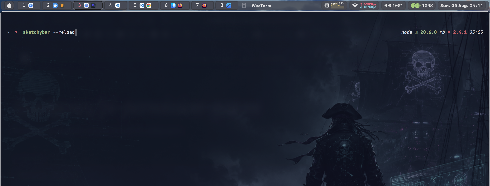

# SketchyBar Configuration

A macOS [SketchyBar](https://github.com/FelixKratz/SketchyBar) configuration written primarily in Lua with [SbarLua](https://github.com/FelixKratz/SbarLua). Native C helpers provide system events, while a standalone Swift/AppKit overlay renders and continuously scrolls the spaces row.


## Features

- Fixed-width native spaces overlay with explicit clipping and no layout feedback loop.
- Application icons on occupied spaces and only the space number on empty spaces.
- Continuous trackpad scrolling with native pixel deltas and momentum.
- Launchd Mach-service activation independent of the Homebrew SketchyBar service.
- Application menus, active-application label, calendar, CPU graph, Wi-Fi details, volume controls, battery status, and media controls.
- Popup controls for network details, audio devices, battery information, and media playback.
- Automatic compilation of native helper binaries when the configuration loads.

## Requirements

### Required

- macOS with **Displays have separate Spaces** enabled in System Settings.
- [Homebrew](https://brew.sh/).
- [SketchyBar](https://github.com/FelixKratz/SketchyBar).
- [SbarLua](https://github.com/FelixKratz/SbarLua), installed under `~/.local/share/sketchybar_lua/`.
- Xcode Command Line Tools for compiling the C helpers.
- SF Pro and SF Mono, as configured in `helpers/default_font.lua`.
- [sketchybar-app-font](https://github.com/kvndrsslr/sketchybar-app-font) for application icons in spaces.

### Optional Integrations

- [yabai](https://github.com/koekeishiya/yabai) for focusing and destroying spaces with mouse clicks.
- [nowplaying-cli](https://github.com/kirtan-shah/nowplaying-cli) for previous, play/pause, and next media actions.
- [switchaudio-osx](https://github.com/deweller/switchaudio-osx) for listing and selecting output devices through `SwitchAudioSource`.

The bar still loads without these optional tools, but their related click actions will not work.

## Installation

### 1. Place the Configuration

Clone or copy this repository so that its root is located at:

```text
~/.config/sketchybar
```

SketchyBar should therefore find the entry point at `~/.config/sketchybar/sketchybarrc`.

### 2. Install SketchyBar and Build Tools

```sh
brew tap FelixKratz/formulae
brew install sketchybar
xcode-select --install
```

If the Command Line Tools are already installed, `xcode-select` reports that no additional installation is necessary.

### 3. Install SbarLua

```sh
(git clone https://github.com/FelixKratz/SbarLua.git /tmp/SbarLua && cd /tmp/SbarLua && make install && rm -rf /tmp/SbarLua)
```

This configuration extends Lua's module path to load `~/.local/share/sketchybar_lua/sketchybar.so`.

### 4. Install Fonts

Install [sketchybar-app-font](https://github.com/kvndrsslr/sketchybar-app-font) for application glyphs. The default text configuration also expects SF Pro and SF Mono.

To use another installed font, edit `settings.lua`. A JetBrainsMono Nerd Font example is already included there.

### 5. Install Optional Commands

```sh
brew install nowplaying-cli switchaudio-osx
```

Install and configure `yabai` separately if you want space focus and destroy actions.

### 6. Install the yabai Configuration

The repository includes `yabai/config/yabairc` because the floating-window guard is activated by yabai signals. On another machine, copy it to yabai's standard configuration path:

```sh
mkdir -p ~/.config/yabai
cp ~/.config/sketchybar/yabai/config/yabairc ~/.config/yabai/yabairc
```

If `~/.config/yabai/yabairc` already exists, merge the `external_bar` setting and the floating-window signal block instead of overwriting your existing rules. Restart yabai after copying or merging the file:

```sh
yabai --restart-service
```

### 7. Build Native Helpers

```sh
make -C ~/.config/sketchybar/helpers
```

`helpers/init.lua` also runs the helper build whenever the configuration loads, so changed C sources are rebuilt automatically.

### 8. Start SketchyBar

```sh
brew services start sketchybar
sketchybar --reload
```

After editing the configuration, apply changes with:

```sh
sketchybar --reload
```

## Configuration

The main user-facing options are in `settings.lua`:

| Setting | Behavior |
| --- | --- |
| `paddings` | General item padding. |
| `group_paddings` | Spacing between grouped bar items. |
| `spaces_overlay_width` | Optional exact overlay width. Leave unset to consume all safe space before the right-side widgets. |
| `spaces_max_width` | Legacy fallback used when `spaces_overlay_width` is unset. |
| `spaces_fallback_width` | Final fallback width used when neither overlay-width setting is configured. |
| `icons` | Selects the configured icon set, such as `sf-symbols` or Nerd Font icons. |
| `font` | Selects the text and number font configuration. |

The spaces overlay queries yabai for the active space count at startup and refreshes automatically when spaces are created or destroyed. Item loading order is controlled by `items/init.lua`.

### Floating Windows and SketchyBar

`yabai -m config external_bar all:30:0` reserves the bar area for BSP and stack layouts. Float spaces do not use that managed layout region, so this configuration also provides `helpers/float_window_guard.sh` and labelled yabai signals in `~/.config/yabai/yabairc`.

The guard keeps ordinary floating windows below the 30-point SketchyBar inset (`28` height plus `2` y-offset). It reacts when windows are created, focused, moved, resized, or deminimized, and it rechecks windows after space or display changes. Native fullscreen windows are ignored.

After changing the helper or yabai configuration:

```sh
chmod +x ~/.config/sketchybar/helpers/float_window_guard.sh
yabai --restart-service
sketchybar --reload
```

Run the helper manually against all known windows with:

```sh
~/.config/sketchybar/helpers/float_window_guard.sh all
```

## Controls

### Spaces and Menus

| Input | Action |
| --- | --- |
| Left-click a space | Focus the space through `yabai`. |
| Right-click a space | Destroy the space through `yabai`. |
| Horizontal or vertical trackpad scroll over the spaces overlay | Scroll continuously using the native pixel delta and momentum. |
| Click the spaces indicator | Toggle between spaces and application menus. |
| Click the front-app label | Toggle between spaces and application menus. |

The native overlay receives scrolling only inside its clipped placeholder. It performs no paging, thresholding, snapping, or per-scroll IPC.

### Widgets

- **Calendar:** Click to open the Calendar app.
- **System Monitor:** Click the current CPU, Memory, Energy, Disk, or Network metric to open the switcher. Selecting a metric replaces the bar item and persists across reloads. Network uses blue inbound and red outbound packet-history lines instead of byte-rate numbers. Select **Open Activity Monitor** to open the app on the matching tab.
- **Wi-Fi:** Click the icon or transfer indicators to toggle network details. Click a detail value to copy it to the clipboard.
- **Volume:** Click to open audio controls, scroll to change volume, or select an output device when `SwitchAudioSource` is installed.
- **Battery:** Click to toggle remaining-time and charging details.
- **Media:** Click the artwork to toggle playback controls. The transport buttons require `nowplaying-cli`.

#### Standalone System Metrics

Each system metric can also be loaded directly in `single` mode. It creates its own bracket and padding, and clicking it opens the matching Activity Monitor tab:

```lua
local memory = require("items.widgets.memory").new({
  mode = "single",
  name = "widgets.memory",
  position = "right",
})
```

Use `mode = "embedded"` when another module owns the bracket, padding, and click behavior. The default `items/widgets/system_monitor.lua` switcher uses this mode for all five metrics.

When Activity Monitor is already running, immediate tab selection uses macOS accessibility UI scripting. If it only activates without changing tabs, grant SketchyBar Accessibility permission in **System Settings → Privacy & Security → Accessibility**.

## Native Spaces Service

The spaces overlay is a standalone LaunchAgent. Build and install it once:

```sh
make -C ~/.config/sketchybar/helpers/spaces_overlay install-service
sketchybar --reload
```

The service advertises `com.vision3.sketchybar.spaces` through launchd and starts on the first SketchyBar sync event. It does not modify the Homebrew installation and does not require Input Monitoring because scrolling is handled directly by the AppKit view.

Remove it with:

```sh
make -C ~/.config/sketchybar/helpers/spaces_overlay uninstall-service
```

## Project Structure

| Path | Purpose |
| --- | --- |
| `sketchybarrc` | Executable Lua entry point loaded by SketchyBar. |
| `init.lua` | Initializes SbarLua, loads the bar modules, and starts the event loop. |
| `bar.lua` | Configures the main bar geometry and appearance. |
| `default.lua` | Defines default item styling. |
| `settings.lua` | Contains user-facing spacing, viewport, icon, and font settings. |
| `colors.lua` | Defines the color palette. |
| `icons.lua` | Defines symbols used throughout the bar. |
| `items/` | Contains spaces, menus, front-app, calendar, media, and widget modules. |
| `helpers/` | Contains Lua helpers, application-icon mappings, native source code, and build files. |
| `helpers/event_providers/` | Contains native event providers for CPU, network, space-window, media, and horizontal-scroll events. |
| `helpers/menus/` | Contains the native application-menu helper. |
| `helpers/spaces_overlay/` | Contains the Swift/AppKit renderer, launchd Mach receiver, and service template. |

The item modules are loaded from `items/init.lua` in their intended bar order.

## Troubleshooting

### Rebuild and Reload

Rebuild every native helper and reload the configuration:

```sh
make -C ~/.config/sketchybar/helpers
sketchybar --reload
```

### Inspect SketchyBar Errors

When SketchyBar runs as a Homebrew service, follow its error log with:

```sh
tail -f "$(brew --prefix)/var/log/sketchybar/sketchybar.err.log"
```

### Native Spaces Overlay Does Not Appear

- Run `make -C ~/.config/sketchybar/helpers/spaces_overlay install-service`.
- Inspect `launchctl print gui/$(id -u)/com.vision3.sketchybar.spaces`.
- Check `~/Library/Logs/SketchyBar/spaces-overlay.err.log` for Mach or AppKit failures.
- Reload SketchyBar so Lua publishes a fresh full-state snapshot.

### Spaces Width Needs Adjustment

- Leave `spaces_overlay_width` unset for automatic sizing, or set it to the exact clipped width you want SketchyBar to reserve.
- Rebuilds do not change this width; only `settings.lua` controls it.

### Optional Actions Do Nothing

Verify that the corresponding executable is available:

```sh
command -v yabai
command -v nowplaying-cli
command -v SwitchAudioSource
```

Missing optional commands do not prevent the rest of the bar from running.

### Wi-Fi Details Are Empty

The Wi-Fi widget currently queries interface `en0`. Check the active hardware ports with:

```sh
networksetup -listallhardwareports
```

If Wi-Fi uses another interface, update the `en0` provider selection in `items/widgets/wifi.lua`. The embedded Network metric shares that provider.

### Icons or Text Are Missing

- Confirm that SF Pro, SF Mono, and `sketchybar-app-font` are installed.
- Reload SketchyBar after installing fonts.
- If using a Nerd Font, update both `icons` and `font` in `settings.lua`.

## Credits

This configuration is based on and inspired by [Felix Kratz's dotfiles](https://github.com/FelixKratz/dotfiles), especially the Lua/SbarLua SketchyBar setup and native helper architecture. Thanks to Felix Kratz and the SketchyBar community for the original work and examples that made this configuration possible.
